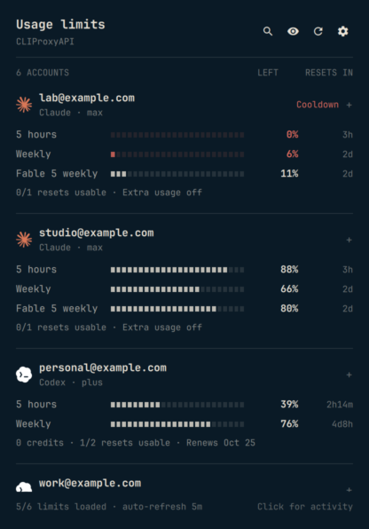
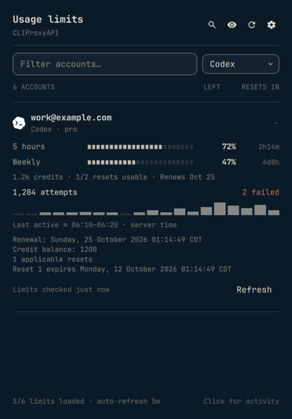

# CLIProxyAPI for Omarchy

Remaining allowance across your AI subscriptions, directly in the Omarchy bar. All account limits appear immediately in a compact native panel, with provider logos, reset countdowns, and automatic refresh.



*380px content width, stock Omarchy typography and controls. Artwork, colors, and meters follow the native desktop. Screenshots use synthetic data.*

## Install

Requires Omarchy with its Quickshell plugin system and Python 3. No Python packages or build step.

```sh
omarchy plugin add https://github.com/spencerbull/omarchy-cliproxyapi --enable
```

Already installed:

```sh
omarchy plugin update spencerbull.cliproxyapi --yes
```

Click the server icon, enter your **server URL** and **management key**, and select **Connect**. Use the management key, not an inference API key. Remote servers require HTTPS and remote management enabled; loopback HTTP is supported. Reverse-proxy prefixes, `/v0/management`, and `/management.html` URLs are accepted.

## Limits first

Every account shows its reported quota windows without needing to expand it. Meters and percentages show **remaining** allowance; the right column shows time until reset. Low allowance is highlighted with Omarchy's urgent color. Missing data stays unknown, never zero.

| Provider | Available information |
| --- | --- |
| Codex | Primary/secondary, code-review, and additional model windows; credits; renewal date; manual-reset allowance and expiry |
| Claude | Five-hour, weekly, scoped/model windows including Fable; extra spending; plan; remaining and applicable reset grants |
| xAI / Grok | Weekly credit and product limits, monthly spending, prepaid balance, and on-demand amounts when returned by billing endpoints |
| Muse / Meta | Current-window and weekly allowance, subscription state and plan, after explicit session consent |

Limits load automatically after connecting, then refresh at most every five minutes while the panel is open. The refresh button or a middle-click on the bar requests a full refresh. Accounts are fetched sequentially, provider retry delays are respected, and failures retain the previous successful limits with a visible error. Authentication failures stop polling until you reconnect.

Credits, renewal dates, and reset counts appear beneath the meters. Expand an account for exact renewal/reset-expiry details, request activity, last request, failed attempts, and per-account refresh. The search button reveals account/provider filters. The eye button hides identities and clears the search.



### Muse permission

Muse's upstream quota endpoint also **issues an API key**. It is never called automatically without permission. **Set up Muse limits** explains this behavior, then **Allow for this session** enables the lookup and periodic refresh for that account. The permission stays in memory and clears on reconnect, forgetting, or restarting the plugin.

The helper reads that account's DCA credential through management, keeps it request-local, and returns only quota fields. Downloaded credentials and any returned API key are neither displayed nor saved. Other providers use fixed read-only GET requests with server-side token substitution.

### Data boundaries

The plugin displays what the provider exposes. Some xAI subscriptions do not expose billing limits through read-only endpoints; this is shown explicitly. It never issues inference probes to manufacture quota data. Unsupported providers remain visible with a reason.

Modern activity counters represent upstream attempts, including retries. Recent activity is reported in ten-minute server-time windows and marked approximate. Exact last-request times, tokens, and models require legacy history uniquely attributed to the account's `auth_index`. Credential refresh or file modification dates are never substituted. Accounts are subscriptions or credentials, not individual running agent processes.

The plugin **never consumes `/usage-queue`, claims reset grants, spends reset credits, changes routing, or sends inference requests**. Availability of a manual reset is information only; this plugin cannot spend it.

## Credentials and privacy

The URL and management key stay in memory by default. The key travels to the helper through stdin, never arguments or environment variables, and the password field clears after submission.

Optional **Remember on this device** stores plaintext credentials outside the plugin:

```text
${XDG_CONFIG_HOME:-~/.config}/omarchy-cliproxyapi/credentials.json
```

The directory is `0700`, the file is `0600`, and writes are atomic. **Forget** deletes this file and clears accounts, quota caches, and Muse consent. Uninstalling does not delete the separate credentials file; forget the connection first.

TLS verification stays enabled. HTTP is allowed only on loopback. Redirects and environment HTTP proxies are disabled. Responses are bounded; errors use fixed messages. Only selected display fields reach QML. Account emails identify subscriptions locally; keys, token payloads, credential filenames, grant identifiers, and upstream error bodies are discarded.

Plugins run as your desktop user. File permissions do not protect saved credentials against another process running as that user. No telemetry is sent.

## Development

```sh
python3 -m unittest discover -s tests -v
node --test tests/test_display.cjs
omarchy plugin validate .
python3 scripts/preview.py
```

The preview uses the actual helper/QML against a loopback-only synthetic API and an isolated configuration directory. Set `OMARCHY_PATH` if shell modules are not found. All preview credentials, quota responses, and account names are fictional, including Muse's key-issuing fixture.

Tests cover quota parsing, consent gates, credential handling, fixed endpoint requests, account attribution, retries, cache freshness, and display semantics. Do not commit real account screenshots, server responses, credentials, or local configuration.

[Provider artwork notices](THIRD_PARTY_NOTICES.md). MIT licensed. Independent community plugin; not affiliated with CLIProxyAPI, Omarchy, or the providers.
