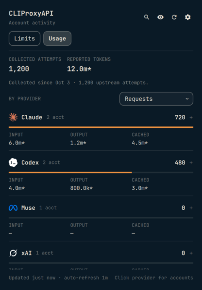
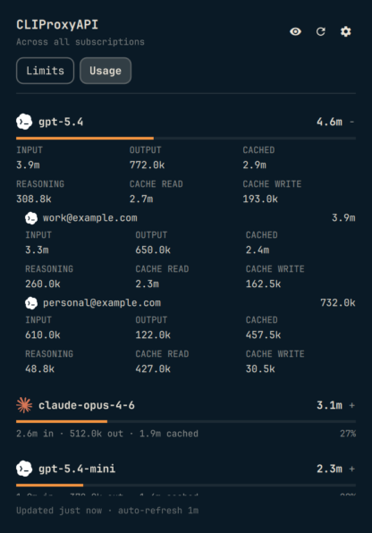

# CLIProxyAPI for Omarchy

Subscription limits and token usage, directly in the Omarchy bar. Switch between remaining allowance and model, provider, and account token breakdowns in a compact native panel with provider logos and automatic refresh.


*380px content width, stock Omarchy typography and controls. Artwork, colors, and meters follow the native desktop. Screenshots use synthetic data.*

## Install

The desktop plugin requires Omarchy with its Quickshell plugin system and Python 3. It needs no Python packages or build step. For the complete installation, including server-side token collection, use [Install with an agent](#install-with-an-agent).

```sh
omarchy plugin add https://github.com/spencerbull/omarchy-cliproxyapi --enable
```

Already installed:

```sh
omarchy plugin update spencerbull.cliproxyapi --yes
omarchy restart shell
```

Restarting reloads the bar and clears cached QML components, so the new interface takes effect. Remember your connection before restarting if you want it restored automatically.

Click the server icon, enter your **server URL** and **management key**, and select **Connect**. Use the management key, not an inference API key. Remote servers require HTTPS and remote management enabled; loopback HTTP is supported. Reverse-proxy prefixes, `/v0/management`, and `/management.html` URLs are accepted.

## Install with an agent

Point your coding agent at this section to install **both** the Omarchy desktop
plugin and its CLIProxyAPI server collector. Installing only the desktop plugin
on a current v8 server shows request counts, but does not supply token history.
The two components use the same server URL and management key.

Copy this prompt into your agent:

```text
Install the complete CLIProxyAPI integration for my Omarchy desktop:
https://github.com/spencerbull/omarchy-cliproxyapi#install-with-an-agent

Read that section and collector/README.md, then install or update the desktop
plugin and enable the usage collector on my existing CLIProxyAPI server.
You may install the collector and restart that server as part of this task.
Discover the existing deployment and available SSH/container access first;
ask me for missing connection details if necessary. Preserve existing accounts,
credentials, routing, plugin settings, collector history, and the running server
version. Back up configuration before changing it. Keep secrets out of chat,
commands, logs, screenshots, and Git. Have me enter the management key in the
plugin's setup screen if there is no saved connection.

Verify the running collector, desktop connection, and native Limits/Usage panes.
Do not consume /usage-queue or send inference requests to manufacture test data.
Report whether token data is arriving or collection is waiting for normal traffic.
```

### Agent installation steps

1. **Inspect both machines.** Identify the Omarchy desktop and the existing
   CLIProxyAPI server; they may be different hosts. Check the actual running
   server version, service/container, architecture, libc, configuration path,
   plugin directory, persistent mounts, and service UID. The collector targets
   **CLIProxyAPI v8.0.16, C ABI 1, RPC schema 6**; verify compatibility before using
   another version. Do not create a second proxy or replace the user's deployment.

2. **Install the desktop plugin.** Use the [install/update commands above](#install).
   Preserve local plugin edits and desktop configuration. If updating, restart
   the Omarchy shell to clear imported QML caches; a session-only connection will
   need to be entered again. Verify the plugin is enabled and the native panel
   opens with both **Limits** and **Usage** tabs. Reuse a saved connection when
   available; otherwise let the user enter the URL/key in the plugin UI. Credential
   persistence is optional and must remain the user's choice.

3. **Build and install the server collector.** Follow
   [collector/README.md](collector/README.md) for the build, tests, configuration,
   storage permissions, and endpoint contract. Build a shared library compatible
   with the server's architecture and libc, including the container's runtime
   when applicable. Install it as `omarchy-usage.so` in the existing plugin
   directory. Put its state in a persistent, private directory owned by the
   effective service UID: directory `0700`, state/lock files `0600`. Preserve any
   existing collector state. For containers, configure paths as seen **inside**
   the container and confirm the backing mount survives container recreation.

4. **Enable with a rollback path.** Save a private backup of the current server
   configuration, any collector binary being replaced, and private collector state. Schema 2 also writes a private `usage.v1.backup.json` on migration; an older collector cannot read schema-2 state. For rollback, stop the service and restore the matching binary and pre-upgrade state together, preserving newer state separately. Merge the collector
   settings into the existing `plugins` section without creating duplicate YAML
   keys or overwriting other plugins. Preserve secrets, provider settings, and
   routing. Apply through the deployment's normal service/container mechanism.
   Compare a Compose file's image with the running image before recreating a
   container; a stale file must not accidentally downgrade the server. Account
   for bind-mounted config files when applying changes. Restart only the affected
   proxy when needed. If startup or management health fails, restore the previous
   configuration/binary and service state; retain collected history.

5. **Verify the complete integration.** Through the existing authenticated
   management connection, verify `omarchy-usage` is registered and effectively
   enabled in `/v0/management/plugins`. Read
   `/v0/management/plugins/omarchy-usage/summary`; expect `schemaVersion: 2` and
   `source: "omarchy-usage"`, and report its `health`/`partial` flags. Reads must
   leave records intact. Confirm state is persisted privately, then refresh the
   desktop **Usage** pane and verify 1D/7D/30D ranges, model/provider totals, and account breakdowns. Check `historySince` and `asOf`; recently upgraded installations must mark incomplete periods rather than present backfilled totals.
   Inspect only sanitized status/metrics; never print the management key or raw
   credential responses. Stop automatic retries if authentication is rejected.

Collection starts when the collector is enabled. Historical token usage is not
backfilled, and accounts without new traffic can still show `—`. If no normal
requests arrive during verification, report **installed and collecting, awaiting
traffic** rather than claiming populated token metrics. Do not spend tokens on a
probe, drain `/usage-queue`, or grant Muse's separate key-issuing permission as
part of installation.

## Limits first

Every account shows its reported quota windows without needing to expand it. Meters and percentages show **remaining** allowance; the right column shows time until reset. Low allowance is highlighted with Omarchy's urgent color. Missing data stays unknown, never zero.

| Provider | Available information |
| --- | --- |
| Codex | Primary/secondary, code-review, and additional model windows; credits; renewal date; manual-reset allowance and expiry |
| Claude | Five-hour, weekly, scoped/model windows including Fable; extra spending; plan; remaining and applicable reset grants |
| xAI / Grok | Weekly credit and product limits, monthly spending, prepaid balance, and on-demand amounts when returned by billing endpoints |
| Muse / Meta | Current-window and weekly allowance, subscription state and plan, after explicit session consent |

Limits load automatically after connecting, then refresh at most every five minutes while the panel is open. The refresh button or a middle-click on the bar requests a full refresh. Accounts are fetched sequentially, provider retry delays are respected, and failures retain the previous successful limits with a visible error. Authentication failures stop polling until you reconnect.

Credits, renewal dates, and reset counts appear beneath the meters. Expand an account for a compact activity chart, last activity, and refresh. Hover the credit/reset summary for exact renewal and reset-expiry details; hover a reset countdown for its full timestamp. The search button reveals account/provider filters. The eye button hides identities and clears the search.


## Token usage

The **Usage** tab shows one combined token total across all accounts and models,
with input, output, and cached tokens directly underneath. Choose **1D**, **7D**,
or **30D** without a dropdown. Ranges are UTC calendar days including today:
1D is today so far, 7D is today plus the previous six days, and 30D includes the
previous 29 days. The daily chart and all breakdowns use that same period.

**Models** ranks each model by reported tokens, combining accounts and providers
that use the same model name. **Providers** shows the corresponding provider
aggregates. Bars show each row's share of the combined token total. Expand a row
for all token fields and its accounts; **Details** reveals reasoning, cache-read,
and cache-write totals. Hover a chart bar or token value for exact counts.
Account search belongs to Limits; it never silently filters Usage totals.
Privacy mode hides account identities in expanded usage rows.





History includes retained usage from accounts that are no longer signed in;
these appear as **Unlinked accounts** in the breakdown. `*` marks partial coverage
and `—` means unreported. Before-collection days stay unknown. Cache and reasoning
can overlap input/output and are never added to the reported total.

Dated model history needs collector **0.2.0 / schema 2**. Upgrading preserves
existing lifetime totals and starts dated history at upgrade time; it cannot
reconstruct earlier days or models. Partial periods say when history began.
Until the collector is upgraded, the pane shows lifetime token totals and provider
breakdowns with the date controls disabled and a clear upgrade message.

### Token history on CLIProxyAPI v8

Current v8 servers expose request counters but no built-in non-consuming token
history API. The optional [server-side collector](collector/README.md) observes
completed usage events, persists minimal aggregates, and exposes an authenticated
read-only summary. It **does not consume `/usage-queue`** and uses the same URL
and management key; the desktop detects its fixed endpoint automatically.

The collector source, build instructions and configuration example are included.
It must be built and enabled on the **proxy server** using that deployment's normal
change procedure. Installing this desktop plugin does not change the server.
Collection begins when enabled; earlier token history is not backfilled. Its
lifetime totals survive restarts and are explicitly marked incomplete after
unclean shutdowns or rejected records. SDK-normalized zero submetrics may mean
an upstream field was omitted; all-zero token records stay unknown.

Legacy servers with `/usage` work without the companion. Attribution uses only a
unique account `auth_index`; unmatched records are excluded and counted. Legacy
cache read/write cannot be reliably separated. Counts are tied to the server's
credential identifiers; replacing credentials in a reused slot may retain that
slot's historical usage.

### Muse permission

Muse's upstream quota endpoint also **issues an API key**. It is never called automatically without permission. **Set up Muse limits** explains this behavior, then **Allow for this session** enables the lookup and periodic refresh for that account. The permission stays in memory and clears on reconnect, forgetting, or restarting the plugin.

The helper reads that account's DCA credential through management, keeps it request-local, and returns only quota fields. Downloaded credentials and any returned API key are neither displayed nor saved. Other providers use fixed read-only GET requests with server-side token substitution.

### Data boundaries

The plugin displays what the provider exposes. Some xAI subscriptions do not expose billing limits through read-only endpoints; this is shown explicitly. It never issues inference probes to manufacture quota data. Unsupported providers remain visible with a reason.

Modern activity counters represent upstream attempts, including retries. Recent activity is reported in ten-minute server-time windows and marked approximate. Exact last-request times and tokens require the companion collector or uniquely attributed legacy history. Dated model history requires the schema-2 collector. Credential refresh or file modification dates are never substituted. Accounts are subscriptions or credentials, not individual running agent processes.

The plugin **never consumes `/usage-queue`, claims reset grants, spends reset credits, changes routing, or sends inference requests**. Availability of a manual reset is information only; this plugin cannot spend it.

## Credentials and privacy

The URL and management key stay in memory by default. The key travels to the helper through stdin, never arguments or environment variables, and the password field clears after submission.

Optional **Remember on this device** stores plaintext credentials outside the plugin:

```text
${XDG_CONFIG_HOME:-~/.config}/omarchy-cliproxyapi/credentials.json
```

The directory is `0700`, the file is `0600`, and writes are atomic. **Forget** deletes this file and clears accounts, quota caches, and Muse consent. Uninstalling does not delete the separate credentials file; forget the connection first.

TLS verification stays enabled. HTTP is allowed only on loopback. Redirects and environment HTTP proxies are disabled. Responses are bounded; errors use fixed messages. Only selected display fields reach QML. Account emails identify subscriptions locally; keys, token payloads, credential filenames, grant identifiers, and upstream error bodies are discarded.

Plugins run as your desktop user. File permissions do not protect saved credentials against another process running as that user. No telemetry is sent.

## Development

```sh
python3 -m unittest discover -s tests -v
node --test tests/test_display.cjs
omarchy plugin validate .
python3 scripts/preview.py
```

The preview uses the actual helper/QML against a loopback-only synthetic API and an isolated configuration directory. Set `OMARCHY_PATH` if shell modules are not found. All preview credentials, quota responses, and account names are fictional, including Muse's key-issuing fixture.

Tests cover quota parsing, consent gates, credential handling, fixed endpoint requests, account attribution, collector parsing, partial coverage, provider aggregation, retries, cache freshness, and display semantics. The companion has separate concurrency, persistence, privacy and compiled ABI checks. Do not commit real account screenshots, server responses, credentials, or local configuration.

[Provider artwork notices](THIRD_PARTY_NOTICES.md). MIT licensed. Independent community plugin; not affiliated with CLIProxyAPI, Omarchy, or the providers.
